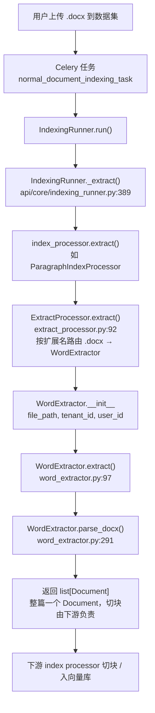
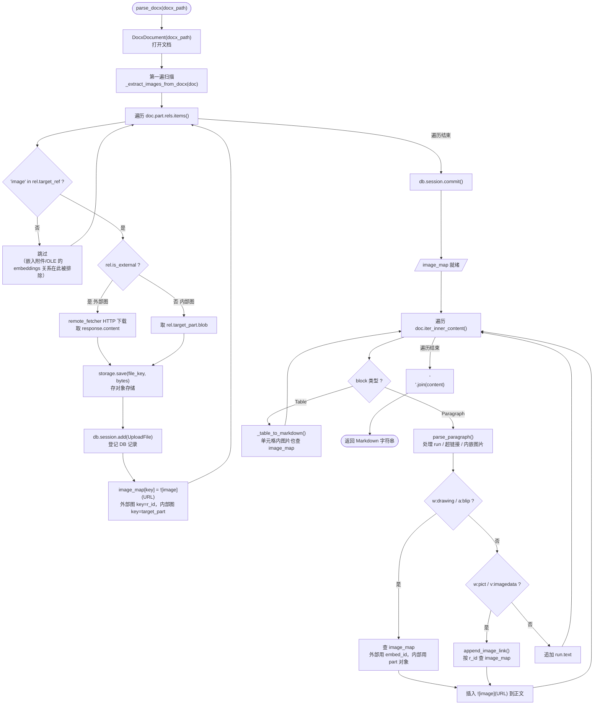

# Dify 项目 DOCX 解析调研

> 调研对象：the Dify source tree
> 关注点：DOCX 解析流程，**图片**与**嵌入附件（OLE / 嵌入文件）**的处理方式
> 不涉及：文本切块（chunking）逻辑
> 调研日期：2026-07-01

## 1. 概述

Dify 中存在**两条相互独立**的 DOCX 解析路径：

| 路径 | 触发场景 | 解析器 | 产物 |
|------|----------|--------|------|
| RAG 知识库入库 | 上传文档到数据集 | `WordExtractor`（仓库内） | 富 Markdown（含表格、超链接、图片链接） |
| Workflow 文档提取节点 | 工作流中「文档提取器」节点 | `graphon` 外部包（v0.5.3） | 纯文本（仅段落拼接，不处理图片） |

两条路径都基于 `python-docx`，但实现深度差异很大。**图片处理只存在于 RAG 路径**；**嵌入附件/OLE 对象两条路径都不处理**。

## 2. RAG 入库路径（主路径）

### 2.1 调用链



### 2.2 调度入口文本版

```
用户上传 .docx 到数据集
  → Celery 任务 normal_document_indexing_task
    → IndexingRunner.run()
      → IndexingRunner._extract()                    # api/core/indexing_runner.py:389
        → index_processor.extract()                  # 如 ParagraphIndexProcessor
          → ExtractProcessor.extract()               # api/core/rag/extractor/extract_processor.py:92
            → WordExtractor(file_path, tenant_id, user_id)
              → WordExtractor.extract()              # word_extractor.py:97
                → WordExtractor.parse_docx()         # word_extractor.py:291
```

### 2.2 调度入口：`ExtractProcessor.extract()`

`api/core/rag/extractor/extract_processor.py` 按扩展名路由。关键点：**无论 `ETL_TYPE` 是 `Unstructured` 还是默认值，`.docx` 都路由到 `WordExtractor`**：

```python
# extract_processor.py（节选，行号约 133 / 172）
if etl_type == "Unstructured":
    ...
    elif file_extension == ".docx":
        extractor = WordExtractor(file_path, upload_file.tenant_id, upload_file.created_by)
    elif file_extension == ".doc":
        extractor = UnstructuredWordExtractor(file_path, unstructured_api_url, unstructured_api_key)
else:
    ...
    elif file_extension == ".docx":
        extractor = WordExtractor(file_path, upload_file.tenant_id, upload_file.created_by)
```

> 注意：`UnstructuredWordExtractor`（`unstructured_doc_extractor.py`）名字里带 docx，但实际只用于**旧版 `.doc`**。`.docx` 永远走 `WordExtractor`。这是一个容易踩坑的命名误导。

### 2.3 `WordExtractor` 主体

`api/core/rag/extractor/word_extractor.py`，依赖 `python-docx`：

```python
from docx import Document as DocxDocument
from docx.oxml.ns import qn
from docx.table import Table
from docx.text.paragraph import Paragraph
from docx.text.run import Run
```

`extract()` 把整个文档解析成单个 `Document`（注意：这里返回的是**整篇一个 Document**，切块由下游 index processor 负责）：

```python
# word_extractor.py:97
@override
def extract(self) -> list[Document]:
    content = self.parse_docx(self.file_path)
    return [Document(page_content=content, metadata={"source": self.file_path})]
```

### 2.4 `parse_docx()` 流程

`word_extractor.py:291`。整体结构：

1. `DocxDocument(docx_path)` 打开文档
2. `image_map = self._extract_images_from_docx(doc)` —— **先把所有图片提取并建好映射**
3. 遍历 `doc.iter_inner_content()`，对每个块：
   - `Paragraph()` → `parse_paragraph()`：处理 run / 超链接 / 旧式 HYPERLINK 域 / 内嵌图片
   - `Table()` → `_table_to_markdown()`：转 Markdown 表格，单元格内图片同样查 `image_map`
4. 用 `\n` 拼接返回

```python
# word_extractor.py:291
def parse_docx(self, docx_path: str) -> str:
    doc = DocxDocument(docx_path)
    content: list[str] = []
    image_map = self._extract_images_from_docx(doc)
    ...
    for block in doc.iter_inner_content():
        match block:
            case Paragraph():
                parsed_paragraph = parse_paragraph(block)
                content.append(parsed_paragraph if parsed_paragraph.strip() else "\n")
            case Table():
                content.append(self._table_to_markdown(block, image_map))
    return "\n".join(content)
```

### 2.5 `parse_docx` 内部流程图



## 3. 图片处理

### 3.1 提取与落盘：`_extract_images_from_docx()`

`word_extractor.py:114-186`。这是图片处理的核心。策略是：**遍历文档 part 的所有 relationship，用子串匹配筛出图片关系，把二进制存到对象存储，再登记一条 `UploadFile` 数据库记录，最后生成 Markdown 预览链接**。

```python
# word_extractor.py:114
def _extract_images_from_docx(self, doc):
    image_count = 0
    image_map = {}
    base_url = dify_config.FILES_URL

    for r_id, rel in doc.part.rels.items():
        if "image" in rel.target_ref:                # ← 关键过滤：子串匹配
            image_count += 1
            if rel.is_external:
                # 外部图：HTTP 下载字节流
                url = rel.target_ref
                if not self._is_valid_url(url):
                    continue
                response = remote_fetcher.make_request("GET", url)
                ...
                image_ext = mimetypes.guess_extension(response.headers.get("Content-Type", ""))
                file_key = "image_files/" + self.tenant_id + "/" + file_uuid + image_ext
                storage.save(file_key, response.content)
                ...
                image_map[r_id] = f""
            else:
                # 内部图：直接取 part 的 blob
                image_ext = rel.target_ref.split(".")[-1]
                file_key = "image_files/" + self.tenant_id + "/" + file_uuid + "." + image_ext
                storage.save(file_key, rel.target_part.blob)   # ← 二进制来源
                ...
                image_map[rel.target_part] = f""
    db.session.commit()
    return image_map
```

要点：

- **过滤条件**：`"image" in rel.target_ref`。这是个**纯子串匹配**，意味着 `media/image1.png` 命中，但 `embeddings/oleObject1.bin` 不命中。这个细节对下一节的嵌入附件结论至关重要。
- **内部图 vs 外部图**：
  - 内部图（`is_external == False`）：二进制取自 `rel.target_part.blob`
  - 外部图（`is_external == True`）：通过 `remote_fetcher` HTTP 下载
- **存储模型**：每张图都 `storage.save()` 到对象存储 + `db.session.add(UploadFile(...))` + 最后一次性 `commit()`。这是 SaaS 多租户模型——图片是平台资产，由 `FILES_URL/files/{id}/file-preview` 提供。
- **`image_map` 的 key 设计**（重要，后面引用时要用）：
  - 外部图 → key 是 `r_id`（关系 id 字符串）
  - 内部图 → key 是 `rel.target_part`（**part 对象本身**，不是字符串）

### 3.2 三处引用 `image_map` 的位置

图片二进制落盘后，正文里要在对应位置插入 ``。`parse_docx` 在三处做这件事：

**A. 段落内的 DrawingML 图片**（`word_extractor.py:314-338`，现代内联/浮动图）：

```python
drawing_elements = run.element.findall(
    ".//{http://schemas.openxmlformats.org/wordprocessingml/2006/main}drawing")
for drawing in drawing_elements:
    blip_elements = drawing.findall(
        ".//{http://schemas.openxmlformats.org/drawingml/2006/main}blip")
    for blip in blip_elements:
        embed_id = blip.get(
            "{http://schemas.openxmlformats.org/officeDocument/2006/relationships}embed")
        if embed_id:
            rel = doc.part.rels.get(embed_id)
            if rel is not None and rel.is_external:
                if embed_id in image_map:                       # 外部图：用 r_id 查
                    target_buffer.append(image_map[embed_id])
            else:
                image_part = doc.part.related_parts.get(embed_id)
                if image_part in image_map:                     # 内部图：用 part 对象查
                    target_buffer.append(image_map[image_part])
```

**B. 段落内的 VML/旧式图片**（`word_extractor.py:340-361`，`w:pict` + `w:binData` / `v:imagedata`）：

```python
shape_elements = run.element.findall(
    ".//{http://schemas.openxmlformats.org/wordprocessingml/2006/main}pict")
for shape in shape_elements:
    shape_image = shape.find(
        ".//{http://schemas.openxmlformats.org/wordprocessingml/2006/main}binData")
    if shape_image is not None and shape_image.text:
        image_id = shape_image.get(
            "{http://schemas.openxmlformats.org/officeDocument/2006/relationships}id")
        if image_id and image_id in doc.part.rels:
            append_image_link(image_id, has_drawing, target_buffer)
    image_data = shape.find(".//{urn:schemas-microsoft-com:vml}imagedata")
    if image_data is not None:
        image_id = image_data.get("id") or image_data.get(
            "{http://schemas.openxmlformats.org/officeDocument/2006/relationships}id")
        if image_id and image_id in doc.part.rels:
            append_image_link(image_id, has_drawing, target_buffer)
```

`append_image_link`（`word_extractor.py:299`）封装了「按 is_external 决定用 r_id 还是 target_part 查 map」的逻辑，且带 `not has_drawing` 去重（避免 DrawingML 与 VML 双重渲染同一张图）。

**C. 表格单元格内图片**（`_parse_cell_paragraph`，`word_extractor.py:233-289`）：同样查 `a:blip` 的 `r:embed`，逻辑与 A 一致。

### 3.3 图片处理小结

| 图片类型 | 是否处理 | 落盘方式 | 正文表现 |
|----------|----------|----------|----------|
| 内联图（DrawingML `a:blip` + `r:embed`） | ✅ | 存对象存储 + DB 记录 | `` |
| 浮动图（DrawingML） | ✅ | 同上 | `` |
| 外部图引用（`r:link` / `is_external`） | ✅ | HTTP 下载后存 | `` |
| 旧式 VML 图（`w:pict` / `v:imagedata` / `w:binData`） | ✅ | 同上 | `` |
| 表格单元格内图片 | ✅ | 同上 | `` |

## 4. 嵌入附件 / OLE 对象

### 4.1 结论：Dify 完全不处理

这是本次调研对 edp 项目最重要的结论。**Dify 对 DOCX 内的嵌入附件、OLE 对象、嵌入文件零处理**——既不提取二进制，也不生成引用，正文里完全不可见。

### 4.2 原因

**原因一：关系过滤的子串匹配把它们排除在外。**

`_extract_images_from_docx` 里唯一的筛选条件是：

```python
if "image" in rel.target_ref:
```

DOCX 内 OLE 对象 / 嵌入文件的 relationship `target_ref` 通常是 `embeddings/oleObject1.bin`、`embeddings/Microsoft_Excel_Worksheet1.xlsx`、`oleObject` 等，**不含 "image" 子串**，因此被静默跳过。提取器只认图片关系，对其他关系视而不见。

**原因二：XML 层从不解析 `w:object`。**

OOXML 里嵌入对象由 `w:object` / `o:OLEObject` 元素承载。全仓库 `/api` 目录搜索 `oleObject` / `w:object` / `o:OLEObject` / `embedded_object` / `embedded_file` 均无相关解析代码。`parse_docx` 只查找：

- `w:drawing` / `a:blip`（DrawingML 图片）
- `w:pict` / `v:imagedata` / `w:binData`（VML 图片）
- `w:hyperlink`（超链接）

从不查找 `w:object`。因此：

| 嵌入内容 | 处理情况 |
|----------|----------|
| 嵌入 Excel 图表 / 工作表 | ❌ 完全不可见 |
| 嵌入 PDF | ❌ 完全不可见 |
| 嵌入文件附件 | ❌ 完全不可见 |
| 其他 OLE 对象 | ❌ 完全不可见 |

> 这意味着：在 Dify 里上传一份内嵌 Excel 的 DOCX，最终入库的 Markdown 里既没有那段嵌入内容，也没有任何指向它的链接——它就像不存在一样。

## 5. Workflow 文档提取节点路径

为完整性简述。该路径由外部 pip 包 `graphon`（v0.5.3，源码不在 dify 仓库）提供，在 `api/core/workflow/node_factory.py` 注册为 `DOCUMENT_EXTRACTOR` 节点。其 `_extract_text_from_docx(file_content: bytes) -> str` 同样用 `python-docx`，但只取段落文本拼接成纯文本，**不处理图片、不处理表格转 Markdown、更不处理嵌入附件**。还附带一个 `_normalize_docx_zip()` 用来修复 Evernote Windows 导出的反斜杠分隔 ZIP。

测试可见 `api/tests/unit_tests/core/workflow/nodes/test_document_extractor_node.py`。

## 6. 关键文件清单

| 路径（dify 仓库） | 作用 |
|-------------------|------|
| `api/core/rag/extractor/word_extractor.py` | DOCX 主解析器，含图片提取（核心） |
| `api/core/rag/extractor/extract_processor.py` | 按扩展名调度到 `WordExtractor` |
| `api/core/rag/extractor/unstructured/unstructured_doc_extractor.py` | 仅 `.doc` 旧版回退（非 `.docx`） |
| `api/core/rag/extractor/extractor_base.py` | `BaseExtractor` 抽象基类 |
| `api/core/indexing_runner.py` | 入库调度上游（`_extract()`） |
| `api/core/rag/index_processor/processor/paragraph_index_processor.py` | index processor 示例，调用 `ExtractProcessor` |
| `api/core/workflow/node_factory.py` | Workflow 文档提取节点注册（graphon 外部包） |
| `api/.env.example` | `FILES_URL` 配置（图片链接 base url） |
| `api/tests/unit_tests/core/rag/extractor/test_word_extractor.py` | `WordExtractor` 单测 |

## 7. 与 edp 项目的对比与启示

| 维度 | Dify | edp |
|------|------|-----|
| 定位 | SaaS 多租户入库 | 离线包产物 |
| 图片落盘 | 对象存储 + DB `UploadFile` + 预览 URL | 本地包内 `image_NN` + `manifest.json` |
| 图片正文表现 | `` | `` 等本地引用 |
| `image_map` 索引 | r_id（外部）/ target_part（内部） | 可参考同一思路 |
| DrawingML / VML 双格式 | ✅ 都处理 | edp `extractor.py` 可参考其双格式覆盖 |
| 嵌入附件 / OLE | ❌ 完全不处理 | ✅ edp 的核心目标 |

**启示**：

1. **Dify 的 `image_map` 设计值得借鉴**：先扫描全部 relationship 建好「关系 → 引用」映射，再在正文遍历时查表插入。这种「两遍扫描」比边遍历边提取更清晰，edp 的 `extractor.py` 可对照参考。
2. **DrawingML + VML 双格式覆盖**是实战必要的——Dify 同时处理 `w:drawing`/`a:blip` 与 `w:pict`/`v:imagedata`/`w:binData`，edp 若只覆盖 DrawingML 会漏掉旧式文档的图片。
3. **Dify 对嵌入附件的「零处理」正是 edp 的差异化价值点**：Dify 用 `"image" in rel.target_ref` 子串过滤，直接把 `embeddings/` 关系挡在门外，且无 `w:object` 解析。edp 要做的就是补上这块——识别 `embeddings/` 关系与 `w:object`/`o:OLEObject` 元素，提取嵌入二进制并回挂为 `attachment_NN`，这正是 edp 项目存在的意义。

## 8. edp 落地建议与当前状态

本项目不应照搬 Dify 的对象存储、`UploadFile` 数据库记录和 `FILES_URL` 预览链路；这些属于 Dify SaaS 入库模型。edp 继续保持离线包产物：`raw/embedded/`、`structured/assets/images/`、`structured/content.md`、`manifest.json` 与 `embedded_resources.jsonl` 是正确边界。

已覆盖：

- `word/embeddings/`、`word/objects/`、`word/activex/` 等附件路径会被提取为 `attachment_NN`。
- OLE `.bin` 会优先解包 `Ole10Native` 或内含 XLSX，无法识别时保留原始二进制。
- DrawingML 图片、VML 图片、表格单元格内图片和表格单元格内附件都会通过关系 id 写入 `[[EDP_ASSET:*]]` sentinel，再由主文档 parser 输出替换为本地 Markdown 引用。
- OLE 对象 run 内的预览图应视为附件图标/预览，不注册为独立 `image_NN`，避免正文中重复出现“附件 + 预览图”两份资产。

后续仍可借鉴：

- Dify 的两遍扫描模式可以继续作为维护准则：先从 relationship 和 XML 上下文建立资产映射，再在正文渲染阶段只做 sentinel 替换。
- 若未来支持外部图片链接，可参考 Dify 的 `rel.is_external` 分支，但 edp 应优先记录警告或可审计下载策略，不能静默访问远端资源。
- 若未来引入 chunking/indexing，应作为下游消费层实现，不应混进当前资产保真与重新挂接层。

---

> 附：关键源码已直接读取 `word_extractor.py` 全文核对（行号准确）。本调研为纯文档产物，未运行 dify 代码。
