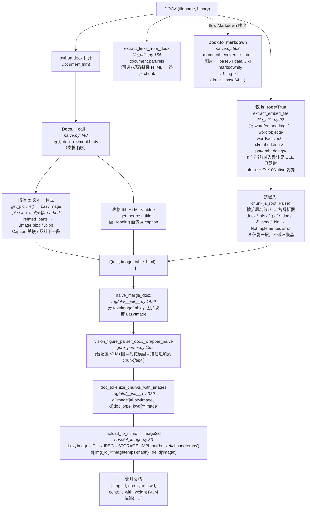

# RAGFlow DOCX 解析调研：嵌入附件与图片处理

> 调研对象：the RAGFlow source tree
> 调研目的：为 `docx-embed` (edp) 项目的 DOCX 嵌入资产提取/回挂能力提供参考。
> 关注点：DOCX 解析流程、**图片处理**、**嵌入附件处理**。不涉及切块（chunking）细节。

---

## 1. 总览

RAGFlow 解析 DOCX 时主要依赖以下库：

| 库 | 用途 | 出现位置 |
|---|---|---|
| `python-docx` (`from docx import Document`) | 结构化解析主体：段落、表格、图片关系 | `deepdoc/parser/docx_parser.py:17`、`rag/app/naive.py` |
| `mammoth` | DOCX → HTML → Markdown，图片转 base64 data URI | `rag/app/naive.py:571`（`to_markdown`） |
| `zipfile` | 直接读取 OOXML 容器，扫描 `word/embeddings/` 等嵌入目录 | `rag/utils/file_utils.py:19` |
| `olefile` | 处理 OLE 容器（.doc/.ppt/.xls）的嵌入流，剥 `Ole10Native` | `rag/utils/file_utils.py:26` |
| `tika` | 仅用于旧版 `.doc`（非 `.docx`）的纯文本解析 | `rag/flow/parser/parser.py:793` |

DOCX 解析有**两条入口**：

- **Legacy / task-executor 路径**：`rag/app/naive.py` 的 `chunk()` 函数（`naive.py:839`）。这是默认 app（naive / manual / book / one / qa / laws 等）走的路径，会做嵌入抽取与递归。
- **Flow 路径**：`rag/flow/parser/parser.py` 的 `_docx()` 方法（`parser.py:783`）。较新的流程化解析器，支持 JSON 与 Markdown 两种输出格式。

两条路径底层都复用 `RAGFlowDocxParser` 及其子类 `naive.Docx` 来遍历文档。

---

## 2. DOCX 解析整体流程

### 2.1 基类 `RAGFlowDocxParser`

**文件**：`deepdoc/parser/docx_parser.py:32`，导出为 `DocxParser`（`deepdoc/parser/__init__.py:17`）。

`__call__(self, fnm, from_page=0, to_page=MAXIMUM_PAGE_NUMBER)`（`docx_parser.py:162`）：

- 用 `Document(fnm)` 或 `Document(BytesIO(fnm))` 打开文档。
- 遍历 `self.doc.paragraphs`，按 run 跟踪分页（`lastRenderedPageBreak`，`docx_parser.py:179`），拼接 run 文本，返回 `(secs, tbls)`——`secs` 是 `(text, style_name)` 列表。
- 表格由 `__extract_table_content`（`docx_parser.py:73`）→ `__compose_table_content`（`docx_parser.py:79`）做"按列类型分类 → 拼成 `表头: 值` 文本"的启发式转换。

注意：基类 `__call__` **段落与表格分开遍历**，丢失了文档原始顺序；图片提取方法 `get_picture` 在基类里定义但基类 `__call__` 不调用。

### 2.2 子类 `naive.Docx`（主用解析器）

**文件**：`rag/app/naive.py:335`，继承 `RAGFlowDocxParser`。

`__call__(self, filename, binary=None, from_page=0, to_page=...)`（`naive.py:448`）：

- 遍历 `self.doc._element.body` 的子块，**按文档顺序**同时处理段落（`...p`）与表格（`...tbl`）——这是相对基类的关键改进。
- 段落块：构造 `Paragraph(block, self.doc)`，取文本与样式；调用 `self.get_picture(self.doc, p)` 抽图（`naive.py:502`）；"Caption" 样式段落会吸收前一张图（`naive.py:473-490`）；空文本但有图时把图挂到 `last_image`，由下一段文本承载或独立成块。
- 表格块：构造 `DocxTable`，调用 `__get_nearest_title(table_idx, filename)`（`naive.py:343`）向前查找最近的 `Heading N` 段落，组装成 `文档 > H1 > H2 > …` 面包屑作为 `<caption>`，并处理 `colspan` 合并单元格，输出 HTML `<table>`。
- 分页跟踪：`lastRenderedPageBreak` 与 `w:br type="page"`（`naive.py` run XML 检查）。
- 返回 `[(text, image, table_html), ...]`，图片以 `LazyImage` 包装。

### 2.3 Flow 路径 `_docx()`

**文件**：`rag/flow/parser/parser.py:783`。

- `.doc`（旧版）：走 `tika` 取纯文本行（`parser.py:790-822`）。
- `.docx`：
  - `extract_word_outlines(name, blob)`（`rag/flow/parser/utils.py:79`）抽 Heading 大纲作为元数据。
  - **JSON 输出**（`parser.py:831-862`）：调 `docx_parser(name, binary=blob)`（即 `naive.Docx.__call__`），可选 `extract_docx_header_footer_texts()`（`utils.py:37`）剥离页眉页脚、去 TOC，再 `enhance_media_sections_with_vision()`（`utils.py:164`）用 VLM 给图/表生成文字描述。
  - **Markdown 输出**（`parser.py:864-874`）：调 `docx_parser.to_markdown(name, binary=blob)`，走 mammoth。

### 2.4 页眉页脚

`extract_docx_header_footer_texts()`（`rag/flow/parser/utils.py:37-52`）：遍历 `doc.sections`，收集 `section.header` / `section.footer` 的段落与表格文本，供 flow 路径可选剥离。

---

## 3. 图片处理（重点）

### 3.1 提取：`get_picture()`

**文件**：`deepdoc/parser/docx_parser.py:33-70`

```python
def get_picture(self, document, paragraph):
    imgs = paragraph._element.xpath(".//pic:pic")
    if not imgs:
        return None
    image_blobs = []
    for img in imgs:
        embed = img.xpath(".//a:blip/@r:embed")   # 关系 ID
        if not embed:
            continue
        embed = embed[0]
        image_blob = None
        try:
            related_part = document.part.related_parts[embed]   # r:embed -> word/media/ part
        except Exception as e:
            logging.warning(f"Skipping image ... {e}")
            continue
        try:
            image = related_part.image
            if image is not None:
                image_blob = image.blob
        except (UnrecognizedImageError, UnexpectedEndOfFileError,
                InvalidImageStreamError, UnicodeDecodeError) as e:
            logging.info(f"Damaged image encountered, attempting blob fallback: {e}")
        except Exception as e:
            logging.warning(f"Unexpected error getting image, attempting blob fallback: {e}")
        if image_blob is None:
            image_blob = getattr(related_part, "blob", None)   # 损坏图回退原始 blob
        if image_blob:
            image_blobs.append(image_blob)
    if not image_blobs:
        return None
    return LazyImage(image_blobs)
```

要点：

- XPath `.//pic:pic` 同时覆盖 `wp:inline`（行内）与 `wp:anchor`（浮动）两种DrawingML 图片。
- 通过 `a:blip/@r:embed` 取关系 ID，再 `document.part.related_parts[embed]` 解析到 `word/media/` 下的图片 part。
- 优先 `related_part.image.blob`；遇到 `UnrecognizedImageError` 等损坏情况回退 `related_part.blob`（原始字节）。
- 一段多图全部收集，包进 `LazyImage`。

> 局限：只识别 `pic:pic`（DrawingML 图片）。对于 `v:object` / `o:OLEObject` / `w:object` 等旧式 OLE 嵌入对象**完全忽略**——它们不是图片，无法被 `get_picture` 捕获（见第 4 节）。

### 3.2 包装：`LazyImage`

**文件**：`rag/utils/lazy_image.py:9-105`

- 持有原始字节 blob 列表 `self._blobs`，**懒解码**：`to_pil()` 用 `Image.open(BytesIO(blob)).convert("RGB")` 按需转 PIL，多图经 `concat_img()` 垂直拼接。
- 通过 `__getattr__` 代理到底层 PIL Image，支持 `__array__`（numpy）与上下文管理器协议。
- 别名 `LazyDocxImage = LazyImage`（`lazy_image.py:105`）。

`concat_img(img1, img2)`（`rag/nlp/__init__.py:1245-1274`）：两个 `LazyImage` 则合并 blob 列表；否则转 PIL 后纵向堆叠。用于"同段多图"或"相邻图片块合并"。

### 3.3 Caption 与图文关联

`naive.py:473-490`：遇到 "Caption" 样式段落时，把前一张图从行列表中弹出，与 caption 文本一起重新插入——把图注绑到图上。
`naive.py:513` 附近：段落无文本但有图时，存入 `last_image`，由下一个有文本的段落承载；若一直无文本则作为独立图片块刷出。

### 3.4 VLM 视觉增强

**文件**：`deepdoc/parser/figure_parser.py`

当租户配置了 IMAGE2TEXT / 视觉 LLM 时：

- `vision_figure_parser_docx_wrapper_naive()`（`figure_parser.py:135-188`）：naive / one app 用。遍历图片 chunk 索引，`open_image_for_processing()` 打开每张图，调 `picture_vision_llm_chunk()` 带提示词（可带上下文文本）请求描述，**把描述追加到 `chunks[idx]['text']`**（`figure_parser.py:188`）。
- `vision_figure_parser_docx_wrapper()`（`figure_parser.py:47-64`）：manual / book app 用，把图片包成 `VisionFigureParser`，把 VLM 描述追加进 `tbls`。
- `VisionFigureParser`（`figure_parser.py:192-281`）：`ThreadPoolExecutor` 并发调 `picture_vision_llm_chunk()`。
- flow 路径对应 `enhance_media_sections_with_vision()`（`rag/flow/parser/utils.py:164-215`）。

效果：图片除了原始像素落储，还会生成一段文字描述并入 chunk 文本，便于检索。

### 3.5 落储：上传 MinIO/S3

`rag/svr/task_executor.py:372-405` 的 `upload_to_minio(document, chunk)`：若 chunk 有 `image` 键则上传，否则删除该键并置 `img_id=""`。

`rag/utils/base64_image.py:33-93` 的 `image2id()`：

```python
async def image2id(d, storage_put_func, objname, bucket="imagetemps"):
    ...
    def encode_image():
        img, close_after = open_image_for_processing(d["image"], allow_bytes=False)
        ...
        if img.mode in ("RGBA", "P"):
            img = img.convert("RGB")
        img.save(buf, format="JPEG")          # 统一转 JPEG
        return buf.getvalue()
    jpeg_binary = await thread_pool_exec(encode_image)
    ...
    await thread_pool_exec(
        lambda: storage_put_func(bucket=bucket, fnm=objname, binary=jpeg_binary))
    d["img_id"] = f"{bucket}-{objname}"       # 复合存储 ID，如 imagetemps-<hash>
    del d["image"]                             # 原始图对象从文档删除
```

- `LazyImage` / PIL → JPEG 字节 → `STORAGE_IMPL.put(bucket="imagetemps", fnm=<chunk hash>, binary=...)`。
- chunk 文档上 `img_id = "imagetemps-{objname}"`，原始 `image` 键删除——索引里只留存储引用。
- 纯图片 chunk 另带 `doc_type_kwd = "image"`。
- 反查：`id2image(image_id, ...)`（`base64_image.py:114-137`）按首个 `-` 拆 `(bucket, key)` 取回 PIL Image。

### 3.6 Markdown 路径的图片

`Docx.to_markdown()`（`rag/app/naive.py:563-604`）：

```python
def to_markdown(self, filename=None, binary=None, inline_images=True):
    import mammoth
    from markdownify import markdownify
    docx_file = BytesIO(binary) if binary else open(filename, "rb")
    def _convert_image_to_base64(image):
        with image.open() as image_file:
            image_bytes = image_file.read()
        encoded = base64.b64encode(image_bytes).decode("utf-8")
        base64_url = f"data:{image.content_type};base64,{encoded}"
        return {"src": base64_url, "alt": f"img_{uuid.uuid4().hex[:8]}"}
    if inline_images:
        result = mammoth.convert_to_html(
            docx_file,
            convert_image=mammoth.images.img_element(_convert_image_to_base64))
    else:
        result = mammoth.convert_to_html(docx_file)
    return markdownify(result.value)
```

图片在 Markdown 里以 `` 内联，不落对象存储——仅在 flow 的 `output_format=markdown` 时走此路。

### 3.7 图片三态总结

| 路径 | 图片最终形态 |
|---|---|
| naive / manual / book（标准切块） | JPEG 存 MinIO，chunk 带 `img_id="imagetemps-{hash}"` + `doc_type_kwd="image"`，可选 VLM 文字描述入文本 |
| flow JSON 输出 | chunk dict 带 `image`（LazyImage/PIL 对象）+ VLM 描述文本 |
| flow Markdown 输出 | `` 内联 base64 |

---

## 4. 嵌入附件处理（重点）

### 4.1 抽取器 `extract_embed_file()`

**文件**：`rag/utils/file_utils.py:92-153`

```python
def extract_embed_file(target) -> List[Tuple[str, bytes]]:
    """Only extract the 'first layer' of embedding, returning raw (filename, bytes)."""
    top = bytes(target)
    head = top[:8]
    out, seen = [], set()

    def push(b, name_hint=""):
        h10 = _sha10(b)                 # SHA-256 前 10 位去重
        if h10 in seen: return
        seen.add(h10)
        ext = _guess_ext(b)
        fname = name_hint.split("/")[-1] if "." in name_hint else f"{h10}{ext}"
        out.append((fname, b))

    # OOXML / ZIP 容器（docx/xlsx/pptx）
    if _is_zip(head):
        with zipfile.ZipFile(io.BytesIO(top), "r") as z:
            embed_dirs = ("word/embeddings/", "word/objects/", "word/activex/",
                          "xl/embeddings/", "ppt/embeddings/")
            for name in z.namelist():
                low = name.lower()
                if any(low.startswith(d) for d in embed_dirs):
                    b = z.read(name); push(b, name)
        return out

    # OLE 容器（doc/ppt/xls）
    if _is_ole(head):
        with olefile.OleFileIO(io.BytesIO(top)) as ole:
            for entry in ole.listdir():
                p = "/".join(entry)
                data = ole.openstream(entry).read()
                if "Ole10Native" in p or "ole10native" in p.lower():
                    data = _extract_ole10native_payload(data)   # 剥 OLE 壳
                push(data, p)
        return out
    return out
```

要点：

- **OOXML 容器**：直接当 zip 扫描 5 个嵌入目录前缀 `word/embeddings/`、`word/objects/`、`word/activex/`、`xl/embeddings/`、`ppt/embeddings/`，逐条读原始字节。
- **OLE 容器**：仅当 `extract_embed_file()` 的输入本身是 OLE 容器（例如顶层 `.doc`/`.xls`/`.ppt` 或上层递归传入的 OLE bytes）时，才用 `olefile` 遍历流；对 `Ole10Native` 流调 `_extract_ole10native_payload()`（`file_utils.py:68-89`）剥掉 OLE 包装还原真实负载。
- **去重**：SHA-256 前 10 位 (`_sha10`)。
- **扩展名推断** `_guess_ext()`（`file_utils.py:45-64`）按魔数：ZIP 进一步看内含 `word/`→`.docx`、`ppt/`→`.pptx`、`xl/`→`.xlsx`；PDF→`.pdf`；OLE→`.doc`；其余→`.bin`。
- 文档字符串明确："Only extract the 'first layer'"——本函数**不递归**进入嵌套容器，递归交给上层 `chunk()`。

`_extract_ole10native_payload()`（`file_utils.py:68-89`）按 Ole10Native 结构解析：跳过 4 字节、3 个 NUL 结尾字符串（filename/src/tmp）、4 字节未知、再读 4 字节 size，取后续 `size` 字节作为真实负载。

### 4.2 RAGFlow 是否 unwrap Word 插入的附件？

结论：**对 DOCX 内部的插入附件不可靠，通常不会 unwrap。**

原因在 `extract_embed_file()` 的分支结构：

1. 输入是 DOCX 时，函数先进入 `_is_zip(head)` 分支，把 `word/embeddings/`、`word/objects/`、`word/activex/` 等目录下的文件直接 `z.read(name)` 后 `push(b, name)`。
2. `push()` 只做 SHA 去重、`_guess_ext()` 和命名，不会调用 `_extract_ole10native_payload()`。
3. 因此 `word/embeddings/oleObject1.bin` 这类 Word “插入对象/附件”常见的 OLE Package part，会以原始 `.bin` 或被 `_guess_ext()` 判成 `.doc` 的形式交给后续 `chunk()` 分派，而不是先剥出真实的 `pdf/txt/xlsx/...` payload。
4. `_extract_ole10native_payload()` 只在 `_is_ole(head)` 分支里调用，也就是“当前输入整体就是 OLE 容器”时才发生；DOCX zip 内部读出的单个 OLE part 没有在 zip 分支中二次 unwrap。

这点和 EDP 当前实现不同：EDP 在读取 DOCX 内部 attachment part 后，会对 `.bin` 走 `_extract_ole10_native_payload()`，能把 `Ole10Native` 里的真实文件名和真实 payload 还原出来，再登记到 `embedded_resources.jsonl` 并保留正文 anchor。

### 4.3 递归：`naive.chunk()` 的 `is_root` 机制

**文件**：`rag/app/naive.py:871-891`

```python
is_root = kwargs.get("is_root", True)
embed_res = []
if is_root:                                   # 仅根调用抽嵌入
    embeds = []
    if binary is not None:
        embeds = extract_embed_file(binary)
    else:
        raise Exception("Embedding extraction from file path is not supported.")
    for embed_filename, embed_bytes in embeds:
        try:
            sub_res = chunk(embed_filename, binary=embed_bytes, lang=lang,
                            callback=callback, is_root=False, **kwargs) or []
            embed_res.extend(sub_res)
        except Exception as e:
            logging.error(f"Failed to chunk embed {embed_filename}: {e}")
            continue
```

- 只有 `is_root=True` 的顶层调用才抽嵌入；递归进去时 `is_root=False`，**嵌套容器的嵌入不再被抽取**——只剥一层。
- 每个嵌入文件按推断出的扩展名走对应分支重新解析，结果 `extend` 进根文档的 `res`（DOCX 在 `naive.py:926`，其它类型在 `naive.py:1192`）。
- 异常被捕获并 `logging.error` 后 `continue`——单个嵌入失败不影响整体。

### 4.4 关键缺口

`naive.chunk()` 按扩展名正则分派（`naive.py:893-1113`）：

| 行 | 正则 | 处理 |
|---|---|---|
| 893 | `\.docx$` | DOCX |
| 930 | `\.pdf$` | PDF |
| 974 | `\.(csv\|xlsx?)$` | CSV/XLSX/XLS |
| 1005 | `\.(txt\|py\|js\|...)$` | 代码/文本 |
| 1014 | `\.(md\|markdown\|mdx)$` | Markdown |
| 1066 | `\.(htm\|html)$` | HTML |
| 1074 | `\.epub$` | EPUB |
| 1082 | `\.(json\|jsonl\|ldjson)$` | JSON |
| 1090 | `\.doc$` | 旧版 DOC（tika） |
| 1113 | else | `NotImplementedError` |

**问题**：

1. **缺 `.pptx` / `.ppt` 分支**：PPTX 解析器存在于 `rag/app/presentation.py` + `deepdoc/parser/ppt_parser.py`，但 `naive.chunk()` 不调它。嵌入的 PowerPoint 命中 `NotImplementedError`，被 `except` 静默跳过。
2. **缺 `.bin` 分支，且 DOCX 内部 `.bin` 不先 unwrap**：`_guess_ext()` 无法识别的 OLE 原始对象返回 `.bin`，同样命中 `NotImplementedError`；即使 `.bin` 实际是 Word 插入附件的 `Ole10Native` 包装，zip 分支也不会先剥壳。
3. **body 内 OLE 引用未解析**：`RAGFlowDocxParser` 只认 `pic:pic` 图片，对 `v:object` / `o:OLEObject` / `w:object` 等 in-document OLE 引用完全不处理——这些形状在解析时被丢弃。
4. **嵌套嵌入丢失**：`is_root=False` 阻止二层抽取，嵌入文件内部再嵌入的内容取不到。
5. **目录前缀过滤的盲区**：只扫 5 个固定前缀路径，未通过 relationship ID 系统性定位嵌入物，凡不在这些目录下的嵌入会被漏掉。

**能正常工作**的场景：DOCX 内嵌 DOCX / XLSX（`word/embeddings/*.docx|*.xlsx`）、OLE 形式的旧版 DOC / XLS（被 `_guess_ext` 识别后走对应分支）。

### 4.5 XLSX / PPTX 解析器（参照）

- **XLSX**：`deepdoc/parser/excel_parser.py` `RAGFlowExcelParser`，用 `openpyxl.load_workbook()` 遍历行列，`_extract_images_from_worksheet`（`excel_parser.py:110`）抽工作表图片。**不**处理 XLSX 内的嵌入对象。
- **PPTX**：`deepdoc/parser/ppt_parser.py` `RAGFlowPptParser`，用 `python-pptx` 遍历幻灯片形状取文本/图。只能从 `rag/app/presentation.py` 进入，**`naive.chunk()` 不会调用它**——这正是嵌入 PPTX 失效的根因。

---

## 5. 端到端流程图



> 注：实线为主路径（legacy `naive.chunk()`），虚线为 flow 的 Markdown 输出分支。嵌入物递归结果并入主路径的 `secs` 后统一走 merge → VLM → 落储。

---

## 6. 对 edp 的启示

### 6.0 与 EDP 当前默认流程的差异

| 维度 | RAGFlow | EDP 当前默认流程 |
|---|---|---|
| 主目标 | 生成 RAG chunk 并入索引 | 生成自包含、可审计文档包 |
| DOCX 嵌入发现 | 扫固定目录前缀：`word/embeddings/`、`word/objects/`、`word/activex/` 等 | 先读 `document.xml.rels` 保留 relationship/anchor，再用同类目录前缀补扫 |
| 正文 OLE 引用 | 不解析 `w:object` / `o:OLEObject` 做原位锚定 | 解析 relationship id 在正文中的出现顺序和段落 anchor |
| DOCX 内部 `.bin` 插入附件 | zip 分支直接读出 `.bin`，不二次 unwrap `Ole10Native` | 对 `.bin` attachment part 尝试 `_extract_ole10_native_payload()`，还原真实文件名和 payload |
| 未支持类型 | 进入 chunk 分派失败后记录 error 并继续，最终可能不进入结果 | 原始 payload 保留在 `raw/embedded/`，登记 `extracted_only` 状态 |
| 输出形态 | chunk 文本、图片对象/对象存储引用、可选 VLM 描述 | `content.md`、`child_files.md`、`position_map.csv`、`embedded_resources.jsonl`、`manifest.json` |
| 无正文 anchor 的目录补扫资源 | 可进入递归 chunk，但不保留原位信息 | 可进入资源登记，`anchor == {}` 明示无法定位正文位置 |

### 6.1 可借鉴

- **嵌入目录扫描清单**（`file_utils.py:118-121`）：`word/embeddings/`、`word/objects/`、`word/activex/`、`xl/embeddings/`、`ppt/embeddings/`——这套前缀清单适合作为 EDP 默认 relationship 扫描之后的补漏 fallback，而不是单独暴露一条 `ragflow_like` 路径。
- **OLE10Native 剥壳结构**（`file_utils.py:68-89`）：旧版 OLE 嵌入物需按 Ole10Native 二进制结构（4B + 3×NUL 串 + 4B + 4B size + payload）还原真实负载。注意 RAGFlow 只在“当前输入整体是 OLE 容器”时调用这段逻辑；EDP 应继续在 DOCX 内部 `.bin` attachment part 上主动尝试 unwrap。
- **魔数判型**（`_guess_ext`，`file_utils.py:45-64`）：不依赖文件名，按 ZIP 内含 `word/`/`ppt/`/`xl/` 前缀区分 docx/pptx/xlsx，PDF/OLE 按魔数——edp 给嵌入物落盘命名时可参考。
- **单层递归策略**：`is_root` 标志只剥一层，避免无限递归 + 控制成本；edp 的递归解析器可沿用此策略（必要时改为有限层深）。
- **图片关系解析与损坏回退**（`get_picture`）：`r:embed` → `related_parts` → `.image.blob`，异常时回退 `.blob`——edp 处理损坏图片时值得套用。
- **SHA 去重**：嵌入物按内容哈希去重，避免同一附件多次落盘。
- **图文关联**：Caption 样式吸收前图、空文本段把图挂到下一段——edp 回挂图片到正文位置时可借鉴这种"图注绑定 + 顺延承载"逻辑。

### 6.2 RAGFlow 的不足（edp 应规避）

- **分派表不全**：缺 `.pptx`/`.ppt`/`.bin` 分支，嵌入的 PPT 与未识别 OLE 对象静默丢失。edp 应确保分派覆盖所有 OOXML/OLE 子类型，或对未识别类型保留原文件并记录而非丢弃。
- **DOCX 内部插入附件不 unwrap**：`word/embeddings/oleObject1.bin` 在 zip 分支只被当作普通 part 读出，不会先剥 `Ole10Native`。EDP 应保留当前对 `.bin` attachment part 的主动 unwrap。
- **不解析 body 内 OLE 引用**：`v:object`/`o:OLEObject`/`w:object` 被忽略，嵌入物在文档中的"锚点位置"丢失。EDP 应继续以 relationship id 的正文出现位置建立 anchor 与 position map。
- **嵌套嵌入不递归**：只剥一层，深层嵌入取不到。edp 可按需支持有限层深递归。
- **依赖目录前缀而非关系**：嵌入物定位靠路径前缀过滤，未通过 `document.xml.rels` 系统性枚举，存在漏网风险。EDP 更稳健的做法是 relationship 优先、目录前缀补漏，并用 hash 去重。
- **图片只认 DrawingML `pic:pic`**：旧式 VML 图片（`v:imagedata`）等其他形态可能漏掉。

---

## 附：关键文件索引

| 文件 | 行 | 作用 |
|---|---|---|
| `deepdoc/parser/docx_parser.py` | 32-186 | `RAGFlowDocxParser`：`get_picture`、`__call__`、表格抽取 |
| `deepdoc/parser/__init__.py` | 17 | 导出 `DocxParser` |
| `rag/app/naive.py` | 335-605 | `Docx` 子类：`__call__`（body 顺序遍历）、`to_markdown` |
| `rag/app/naive.py` | 839-928 | `chunk()` 入口：嵌入抽取 + 递归 + 解析 + merge + VLM |
| `rag/app/naive.py` | 823-836 | `load_from_xml_v2` 猴补丁（绕 python-docx NULL 引用 bug） |
| `rag/utils/file_utils.py` | 29-153 | `_is_zip/_is_ole/_guess_ext/_extract_ole10native_payload/extract_embed_file` |
| `rag/utils/file_utils.py` | 156-177 | `extract_links_from_docx` 超链接抽取 |
| `rag/utils/lazy_image.py` | 9-105 | `LazyImage` 懒加载 PIL |
| `rag/utils/base64_image.py` | 33-137 | `image2id` / `id2image` MinIO 上传/反查 |
| `deepdoc/parser/figure_parser.py` | 47-281 | VLM 图像描述（`vision_figure_parser_docx_wrapper_naive` 等） |
| `rag/svr/task_executor.py` | 372-405 | `upload_to_minio` |
| `rag/flow/parser/parser.py` | 783-874 | flow 路径 `_docx()`（JSON / Markdown 输出） |
| `rag/flow/parser/utils.py` | 37-215 | 页眉页脚剥离、大纲抽取、`enhance_media_sections_with_vision` |
| `rag/nlp/__init__.py` | 1245-1274 | `concat_img` 图片拼接 |
| `rag/nlp/__init__.py` | 1499-1521 | `naive_merge_docx` |
| `deepdoc/parser/excel_parser.py` | 29-322 | XLSX 解析（不处理嵌入） |
| `deepdoc/parser/ppt_parser.py` | 22+ | PPTX 解析（`naive.chunk` 不调用） |
