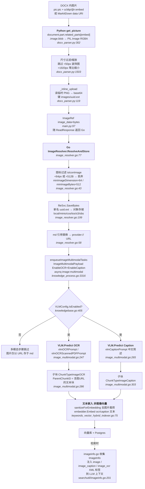

# WeKnora DOCX 解析调研：双进程解析与图片处理

> 调研对象：the WeKnora source tree（v0.6.x，腾讯开源，MIT；Go 主应用 + Python `docreader` gRPC 微服务）
> 关注点：DOCX 解析流程，**图片**处理流程，**嵌入附件（OLE / 嵌入文件）**的处理方式
> 调研日期：2026-07-06

## 1. 总览

WeKnora 是一个 LLM 驱动的企业级 RAG 知识库框架，多语言架构：

| 模块 | 语言 | 职责 |
|------|------|------|
| 主应用（REST/异步任务/切块/嵌入/检索/RBAC/Agent） | Go（`internal/`、`cmd/`） | 编排、存储、向量索引、多模态调度 |
| `docreader` 文档解析微服务 | Python（`docreader/`，gRPC :50051） | 把 PDF/DOCX/XLSX/EPUB 等解析为 **markdown + 图片字节** |
| 前端 / CLI | TypeScript / Go | Web UI 与 `weknora` CLI |

**核心分工原则**（`docreader/parser/base_parser.py:13-19` 注释明示）：重构后 `BaseParser` **只抽 markdown 文本与原始图片引用**；**切块、图片落储、OCR、VLM Caption 全部由 Go 侧负责**。这与 RAGFlow（全在 Python 仓内）和 Dify（全在 Python 仓内）的形态截然不同——WeKnora 把"解析"与"加工"切成两个进程，靠 gRPC 串接。

DOCX 解析引擎注册表（`internal/infrastructure/docparser/engine_registry.go`）支持 `builtin`（走 docreader）、`markitdown`、`weknoracloud`、`mineru`、`mineru_cloud`。本文聚焦默认的 `builtin` 引擎。依赖库（`docreader/pyproject.toml`）：

| 库 | 用途 | 出现位置 |
|---|---|---|
| `markitdown[docx,pdf,xls,xlsx]>=0.1.3` | **主路径**：微软 MarkItDown，DOCX→markdown，图片转 data URI | `docreader/parser/markitdown_parser.py:66` |
| `python-docx>=1.2.0` | **回退路径**：自写 `Docx` 类，按段落/表格/图片抽取 | `docreader/parser/docx_parser.py:75` |
| Pillow (PIL) | 图片解码/缩放/转 RGBA | `docreader/parser/docx_parser.py:332` |

## 2. DOCX 解析整体流程

### 2.1 调用链

```mermaid
flowchart TD
    UP["用户上传 .docx<br/>Go app 入队 asynq ProcessDocument"]

    UP --> PD["<b>Go: knowledgeService.ProcessDocument</b><br/><i>knowledge_process.go:2664</i><br/>asynq 任务处理器"]
    PD --> CONV["convert()<br/><i>knowledge_process.go:3078</i><br/>构建 ReadRequest, 读文件字节"]
    CONV --> RES["resolveDocReader<br/><i>knowledge_process.go:3261</i><br/>builtin 引擎 → GRPCDocumentReader"]
    RES --> CALL["callDocReaderWithTimeout → reader.Read<br/><i>knowledge_process.go:3225</i>"]

    subgraph PY ["Python docreader · gRPC :50051"]
        CALL --> SRV["DocReaderServicer.Read / ReadStream<br/><i>main.py:189 / :226</i>"]
        SRV --> REG["Parser.parse_file → 注册表<br/>docx → Docx2Parser<br/><i>registry.py:129</i>"]
        REG --> CHAIN["<b>Docx2Parser = FirstParser</b><br/><i>docx2_parser.py:10</i><br/>_parser_cls = MarkitdownParser, DocxParser"]
        CHAIN --> MD["<b>主路径 MarkitdownParser</b><br/>= PipelineParser StdMarkitdownParser, MarkdownParser<br/><i>markitdown_parser.py:77</i><br/>MarkItDown.convert keep_data_uris=True<br/>→ 规范化表格 + 抽 base64 图"]
        MD -- "is_valid 失败/空" --> FALL["<b>回退 DocxParser</b><br/>python-docx + 多进程<br/>仅段落文本 + pic:pic 图 + 表格HTML<br/>heading/list/hyperlink 全丢<br/><i>docx_parser.py:104</i>"]
        MD --> DOC["Document content:markdown, images:ref→base64<br/><i>markitdown_parser.py:62</i>"]
        FALL --> DOC
        DOC --> RESP["ReadResponse markdown_content + image_refs bytes<br/><i>main.py:205</i>"]
    end

    RESP --> IST["<b>Go: imageResolver.ResolveAndStore</b><br/><i>knowledge_process.go:2997</i><br/>图片存对象存储, md 引用 → provider:// URL"]
    IST --> CHK["chunker.Split / SplitParentChild<br/><i>knowledge_process.go:3037 / :3057</i><br/>自适应 heading→heuristic→recursive→legacy<br/>默认 512/80, 保护表格/图片/代码/LaTeX"]
    CHK --> PCK["processChunks<br/><i>knowledge_process.go:253</i><br/>嵌入 + 入向量库/PG, 入队多模态任务"]
```



文本版调用链：

```
用户上传 .docx → Go app 入队 asynq ProcessDocument
  → knowledgeService.ProcessDocument(ctx, t *asynq.Task)        # knowledge_process.go:2664
    → convert(...)                                              # :3078  构建 ReadRequest, 读文件字节
      → resolveDocReader(engine, "docx", ...)                   # :3261  builtin → GRPCDocumentReader
        → callDocReaderWithTimeout → reader.Read(callCtx, req)   # :3225
          → gRPC ReadStream（unary Read 兜底）                   # grpc_parser.go:117
            ── 跨进程 ──▶ Python docreader
              → DocReaderServicer.Read / ReadStream              # main.py:189 / :226
                → Parser.parse_file(...)                         # parser.py:34
                  → 注册表 docx → Docx2Parser                     # registry.py:129
                    → Docx2Parser(FirstParser) 先成功链            # docx2_parser.py:10
                      → MarkitdownParser（主） / DocxParser（回退）
                    → 返回 Document{content, images}
              ← ReadResponse{markdown_content, image_refs[]}      # main.py:205
            ◀── 跨进程 ──
        ← Go 收到 ReadResult{MarkdownContent, ImageRefs, ...}     # types/docparser.go:19
      → imageResolver.ResolveAndStore(...)                        # knowledge_process.go:2997
      → chunker.Split / SplitParentChild(...)                     # :3037 / :3057
      → processChunks(...)                                        # :253  嵌入+入向量库, 入队多模态任务
```

### 2.2 解析后端：MarkItDown 主 + python-docx 回退

`Docx2Parser` 是一个 `FirstParser`（先成功链），按顺序尝试两个解析器，第一个产出合法 `Document` 的胜出：

```python
# docreader/parser/docx2_parser.py:10
class Docx2Parser(FirstParser):
    _parser_cls = (MarkitdownParser, DocxParser)
```

`FirstParser.parse_into_text` 逐个尝试，靠 `document.is_valid()` 判定成败，全失败则返回空 `Document`（`chain_parser.py:48-72`）：

```python
# docreader/parser/chain_parser.py:48
def parse_into_text(self, content: bytes) -> Document:
    for p in self._parsers:
        try:
            document = p.parse_into_text(content)
        except Exception:
            continue
        if document.is_valid():          # :69  第一个合法即返回
            return document
    return Document()
```

**主路径 `MarkitdownParser`** 是一个 `PipelineParser`（顺序链），先把字节交给 `StdMarkitdownParser` 调微软 MarkItDown 转 markdown，再交 `MarkdownParser` 规范化表格、抽取 base64 图片：

```python
# docreader/parser/markitdown_parser.py:77
class MarkitdownParser(PipelineParser):
    _parser_cls = (StdMarkitdownParser, MarkdownParser)
```

`StdMarkitdownParser` 调 `MarkItDown.convert(..., keep_data_uris=True)`，图片以 `data:image/...;base64,...` 内联在 markdown 里；若带 data URI 失败则去掉重试一次（`markitdown_parser.py:49-56`）。注意 :53 日志里的 "embedded images" 指 base64 data URI 内联图，**与 OLE 嵌入对象无关**。

```python
# docreader/parser/markitdown_parser.py:34
def parse_into_text(self, content: bytes) -> Document:
    ...
    with parser_worker_limit("markitdown", CONFIG.markitdown_max_workers):
        result = self._convert_markitdown(content, ext, keep_data_uris=True)   # :50
        if result is None:
            result = self._convert_markitdown(content, ext, keep_data_uris=False)  # :56
    text = result.text_content
    images: dict[str, str] = {}
    ...
    return Document(content=text, images=images)   # :62

# :64
def _convert_markitdown(self, content: bytes, ext: str | None, *, keep_data_uris: bool):
    try:
        return self.markitdown.convert(                       # :66
            io.BytesIO(content),
            file_extension=ext,
            keep_data_uris=keep_data_uris,
        )
    except Exception:
        if keep_data_uris:
            return None
        raise
```

> 注：`MarkdownParser`（`markdown_parser.py:440`）本身也是个 `PipelineParser`，`_parser_cls = (MarkdownTableFormatter, MarkdownImageBase64)`（:451）——先规范表格、再抽 base64 图入 `Document.images`。

**回退路径 `DocxParser`** 用 `python-docx` 自写解析（`docx_parser.py`，约 1500+ 行，多进程）。文件顶部 :16-34 对 `_SerializedRelationships.load_from_xml` 做了 monkey-patch，跳过 `NULL` 关系目标以兼容畸形 DOCX。入口：

```python
# docreader/parser/docx_parser.py:104
def parse_into_text(self, content: bytes) -> DocumentModel:
    ...
    docx_processor = Docx(
        max_image_size=1920,            # :141
        enable_multimodal=True,
        upload_file=_inline_upload,
    )
    all_lines, tables = docx_processor(   # :145  返回 (文本/图片序列, 表格HTML列表)
        binary=content,
        max_workers=max_workers,
        to_page=self.max_pages,
    )
    ...
    logger.info(f"extracted {len(all_lines)} sections and {len(tables)} tables")   # :153
    ...
    text_parts = []
    image_parts: Dict[str, str] = {}
    for sec_idx, line in enumerate(all_lines):   # :162  只迭代 all_lines
        ...
        if line.text: text_parts.append(line.text)
        if line.images: ...                       # 图片 base64 入 image_parts
    text = "\n\n".join([part for part in text_parts if part])   # :190
    ...
    return DocumentModel(content=text, images=image_parts)   # :204  不含 tables
```

### 2.3 元素处理对比

两条路径对 OOXML 元素的覆盖差异巨大：

| DOCX 元素 | 主路径 MarkItDown | 回退路径 DocxParser |
|---|---|---|
| 段落文本 | ✅ | ✅ `paragraph.text` |
| 标题 `w:pStyle` | ✅ `#`/`##`/`###` | ❌ 丢失（只取 `paragraph.text`） |
| 列表 `w:numPr` | ✅ `-`/`1.` | ❌ 丢失 |
| 表格 | ✅ GFM 管道表 | ⚠️ `_convert_table_to_html`(:1055) 产出 HTML，但**被丢弃**（见 4.7） |
| 超链接 `w:hyperlink` | ✅ `[text](url)` | ❌ 丢失 |
| 加粗/斜体 | ✅ `**b**`/`*i*` | ❌ 丢失 |
| 图片 | ✅ data URI | ✅ `pic:pic`（见 3.1） |
| 页眉/页脚/脚注/尾注/TOC | ❌ | ❌ |
| 嵌入附件/OLE | ❌ | ❌（见第 4 章） |

### 2.4 输出格式

Python 侧返回 `Document`（`docreader/models/document.py`）`{content: str, images: Dict[ref, base64]}`，经 gRPC 序列化为 `ReadResponse{markdown_content, image_refs[], image_dir_path, metadata}`（`main.py:205`）。Go 侧收为 `ReadResult`：

```go
// internal/types/docparser.go:19
type ReadResult struct {
    MarkdownContent string
    ImageDirPath    string
    ImageRefs       []ImageRef   // :30  ImageRef{Filename, OriginalRef, MimeType, ImageData []byte}
    Metadata        map[string]string
    ...
}
```

即：**DOCX 解析的产物 = 一段 markdown + 一组内联图片字节**，没有结构化 JSON、没有 chunk、没有原始样式。所有后续加工都在 Go 侧。

### 2.5 切块（Go 侧）

切块完全在 Go 侧、docreader 返回之后进行（`internal/infrastructure/chunker/`）。默认 512 字符 / 80 重叠：

```go
// internal/infrastructure/chunker/splitter.go:104
DefaultChunkSize    = 512
DefaultChunkOverlap = 80
```

自适应分层策略（`strategy.go:19-23`）：`auto`（默认，由 profiler 选层）→ `heading`（按 `#`/`##` 切，保留标题面包屑）→ `heuristic`（语言感知句/段启发）→ `recursive`/`legacy`（递归分隔符兜底）。各层按序尝试、校验，不达标降级，最终落到 `legacy`。

保护模式（`splitter.go:117-130`）定义了**不可切穿**的正则模式：

```go
// internal/infrastructure/chunker/splitter.go:117
var protectedPatterns = []*regexp.Regexp{
    regexp.MustCompile(`(?s)\$\$.*?\$\$`),                  // LaTeX 块公式
    regexp.MustCompile(`!\[[^\]]*\]\([^)]+\)`),             // Markdown 图片
    regexp.MustCompile(`\[[^\]]*\]\([^)]+\)`),              // Markdown 链接
    regexp.MustCompile("(?m)[ ]*(?:\\|[^|\\n]*)+\\|[\\r\\n]+\\s*(?:\\|\\s*:?-{3,}:?\\s*)+\\|[\\r\\n]+"), // 表头+分隔行
    regexp.MustCompile("(?m)[ ]*(?:\\|[^|\\n]*)+\\|[\\r\\n]+"),                                          // 表行
    regexp.MustCompile("(?s)```(?:\\w+)?[\\r\\n].*?```"),                                                // 围栏代码块
}
```

父子切块（`ChunkingConfig.EnableParentChild`，`knowledgebase.go:150-181`）：父块默认 4096 字符、子块默认 384 字符，检索命中子块、返回父块上下文。

## 3. 图片处理（重点）

WeKnora 的图片处理横跨两个进程：**Python 只负责提取与字节传递**，**Go 负责落储、OCR、Caption、索引**。

### 3.1 提取

- **主路径（MarkItDown）**：图片以 `data:image/...;base64,...` 内联在 markdown 里，由 `MarkdownParser` 链中的 `MarkdownImageBase64` 抽出存入 `Document.images`（ref→base64）。
- **回退路径（DocxParser）**：用 python-docx 的关系 API，不走 zip 直读 `word/media/`。`Docx.get_picture`（`docx_parser.py:302-342`）通过 XPath 取 DrawingML 图片，再经 `a:blip/@r:embed` 关系 ID 解析到对应 part：

```python
# docreader/parser/docx_parser.py:302
def get_picture(self, document, paragraph) -> Optional[Image.Image]:
    img = paragraph._element.xpath(".//pic:pic")          # :304  覆盖 wp:inline / wp:anchor
    if not img:
        return None
    img = img[0]
    embed = img.xpath(".//a:blip/@r:embed")[0]            # :310  关系 ID
    related_part = document.part.related_parts[embed]      # :311  解析到 word/media/ 下的 part
    image_blob = related_part.image.blob                   # :315
    image = Image.open(BytesIO(image_blob)).convert("RGBA")  # :332
    return image
```

> 要点：`.//pic:pic` 同时覆盖行内（`wp:inline`）与浮动（`wp:anchor`）两种 DrawingML 图片；VML（`w:pict`/`v:imagedata`）与 OLE（`w:object`）**都不在此 XPath 内**（见第 4 章）。

### 3.2 尺寸过滤与缩放

在多进程序列里（`docx_parser.py` 的 `_extract_image_in_process`），对抽出的 PIL 图做两道处理：

- **跳过过小图**：宽或高 <50px 视为装饰图标，丢弃。
- **大图等比缩放**：超过 `max_image_size`（DOCX 硬编码 `1920`，`docx_parser.py:141`/`:294`）则按比例缩小（`:1503`）。

```python
# docreader/parser/docx_parser.py:1503
if image.width > max_image_size or image.height > max_image_size:
    ...  # 按 min(max_image_size/width, max_image_size/height) 等比缩放
```

PDF 路径另走 `DOCREADER_PDF_RENDER_MAX_EDGE`（默认 2000px，`config.py:118`）。

### 3.3 落储

Python 侧不落盘到对象存储，只把字节 base64 后塞进 `Document.images`，键名 `images/<uuid4 hex>.<ext>`：

```python
# docreader/parser/docx_parser.py:119  _inline_upload
def _inline_upload(local_path: str) -> str:
    """Read temp image file, base64-encode, and return a ref path.
    The Go-side ImageResolver (or main.py _resolve_images) handles
    actual storage upload from Document.images."""
    ...
    ref = f"images/{_uuid.uuid4().hex}{ext}"      # :132
    inline_images[ref] = base64.b64encode(raw).decode()
    return ref
```

注释（:122-124）明确点出"实际存储上传由 Go 侧 `ImageResolver` 处理"。gRPC 层 `_resolve_images`（`main.py:57`）把每个图包成 `ImageRef(image_data=bytes)`（`main.py:97`）随 `ReadResponse` 返回。

**Go 侧 `ImageResolver.ResolveAndStore`**（`image_resolver.go:77`）统一处理 markdown 里的各种图片形态：linked images、`data:` URI、`` data URI、裸 base64、`http(s)://` 远程图（带 SSRF 防护、10MB/30 图上限）。对 `result.ImageRefs` 里的内联图：

```go
// internal/infrastructure/docparser/image_resolver.go:43
func isIconImage(data []byte) bool {
    cfg, _, err := image.DecodeConfig(bytes.NewReader(data))
    if err != nil {
        return len(data) < minImageBytes          // :47  minImageBytes = 512  (:37)
    }
    if cfg.Width < minImageDimension && cfg.Height < minImageDimension {  // :49  =64 (:34)
        return true
    }
    return false
}

// :56
type StoredImage struct {
    OriginalRef string // 原始 markdown 引用
    ServingURL  string // provider:// URL，如 local://images/xxx.png, minio://bucket/key
    MimeType    string
}
```

非图标图调 `fileSvc.SaveBytes(ctx, ref.ImageData, tenantID, fileName, false)`（:199，新名 `uuid.New().String()+ext`）写入对象存储，并把 markdown 里的引用替换为 `provider://` URL。支持的后端（`isProviderScheme`，:237）：`local`/`minio`/`cos`/`tos`/`s3`/`obs`，按租户配置切换。

### 3.4 OCR 与 Caption（VLM 统一）

**WeKnora 不使用 Tesseract / PaddleOCR / EasyOCR 做逐图 OCR。OCR 与 Caption 都由同一个 VLM（视觉语言模型）完成**，没有独立 OCR 引擎。提示词常量（`image_multimodal.go:27-50`）：

```go
// internal/application/service/image_multimodal.go:27
vlmOCRPrompt = "<system_prompt>\n" + ...           // 抽全部正文为 Markdown，表格用 MD 表，公式用 LaTeX
vlmOCRScannedPDFPrompt = "<system_prompt>\n" + ... // :38  扫描件变体，保留段落/层级
vlmCaptionPrompt = "Provide a brief and concise description of the main content of the image in Chinese"  // :50
```

执行（`image_multimodal.go:237-273`）：

```go
if payload.EnableOCR {                                   // :237
    prompt := vlmOCRPrompt                               // :238
    if payload.ImageSourceType == "scanned_pdf" {        // :239  扫描件走专用提示词
        prompt = vlmOCRScannedPDFPrompt
    }
    ocrText, ocrErr := vlmModel.Predict(ctx, [][]byte{imgBytes}, prompt)  // :247
    ...
    ocrText = sanitizeOCRText(ocrText)                   // :252
}
caption, capErr := vlmModel.Predict(ctx, [][]byte{imgBytes}, vlmCaptionPrompt)  // :265
```

VLM 接口与三种实现（`internal/models/vlm/`）：

```go
// internal/models/vlm/vlm.go:15
type VLM interface {
    Predict(ctx context.Context, imgBytes [][]byte, prompt string) (string, error)
    GetModelName() string
    GetModelID() string
}
```

| 实现 | 适用 | 要点 |
|---|---|---|
| `RemoteAPIVLM`（`remote_api.go`） | OpenAI 兼容 API（GPT-4V、Qwen-VL 等） | 图字节转 base64 data URI，`Detail: ImageURLDetailAuto`（:129）；默认 180s 超时（:24）、5000 max tokens（:25/:143）、temperature 由配置决定；支持 Azure OpenAI |
| `OllamaVLM`（`ollama.go`） | 本地 Ollama 视觉模型 | 图字节作 `ollamaapi.ImageData`，temperature 0.1 |
| `WeKnoraCloudVLM`（`weknoracloud.go`） | WeKnora 自有云 | — |

是否启用由 `VLMConfig.IsEnabled()`（`knowledgebase.go:405-415`）决定：新版 `Enabled && ModelID != ""`，老版兼容 `ModelName != "" && BaseURL != ""`。

```go
// internal/types/knowledgebase.go:387
type VLMConfig struct {
    Enabled       bool   `json:"enabled"`
    ModelID       string `json:"model_id"`      // 新版：经 ModelService 解析
    ModelName     string `json:"model_name"`    // 老版兼容
    BaseURL       string `json:"base_url"`      // 老版兼容
    APIKey        string `json:"api_key"`       // 老版兼容
    InterfaceType string `json:"interface_type"` // "ollama" 或 "openai"
}
```

> 注意区分：`internal/infrastructure/docparser/paddleocr_vl_converter.go` 是**整文档解析引擎**（租户对 PDF/图片可选 `paddleocr_vl` 引擎，调自建 `/layout-parsing` 端点），**不是**逐图 OCR 步骤。逐图 OCR 永远走 VLM。

### 3.5 子块与索引：文本嵌入，非图像向量

VLM 产出的 OCR/Caption 文本各自成为一个**子块**，挂在"含图片 URL 的文本块"下（`image_multimodal.go:279-311`）：

```go
// internal/application/service/image_multimodal.go:279
if imageInfo.OCRText != "" {
    newChunks = append(newChunks, &types.Chunk{
        Content:       imageInfo.OCRText,        // :285  OCR 文本
        ChunkType:     types.ChunkTypeImageOCR,  // :286
        ParentChunkID: payload.ChunkID,          // :287  父块=含图 URL 的文本块
        ImageInfo:     string(imageInfoJSON),    // :290  {url, ocr, caption}
        ...
    })
}
if imageInfo.Caption != "" {
    newChunks = append(newChunks, &types.Chunk{
        Content:       imageInfo.Caption,            // :302
        ChunkType:     types.ChunkTypeImageCaption,  // :303
        ParentChunkID: payload.ChunkID,
        ...
    })
}
```

**关键：入向量库的是 OCR/Caption 文本，不是图像向量。** `indexChunks`（`image_multimodal.go:368`）构造 `IndexInfo{Content: chunk.Content}`（即文本字符串），调 `BatchIndex`，最终走文本嵌入，且嵌入前用 `sanitizeForEmbedding` 剥离图片载荷：

```go
// internal/application/service/retriever/keywords_vector_hybrid_indexer.go:75
embedding, err := embedder.Embed(ctx, sanitizeForEmbedding(ctx, indexInfo.Content))
```

> 仓内有测试 `TestBatchIndexRemovesInlineImagePayloadBeforeEmbedding` 专门保证"嵌入前剥离内联图片载荷"。即 WeKnora 的"图像检索"本质是**图像→VLM→文本→文本嵌入**，并非真正的多模态向量。仓里虽存在 `AliyunEmbedder`（multimodal-embedding 端点）、`VolcengineEmbedder`、jina-clip-v1 等多模态嵌入实现，但图像多模态管线并不把图字节喂给它们——只喂 OCR/Caption 文本。

任务编排：`enqueueImageMultimodalTasks`（`knowledge_process.go:3316`）为每个 `StoredImage` 找到包含该图 URL 的 chunk，构造 `ImageMultimodalPayload{EnableOCR: true, EnableCaption: true}`（`task.go:253-264`），入 asynq 队列 `image:multimodal`（`task.go:39`）。

### 3.6 检索时增强

检索阶段，`searchutil/imageinfo.go` 收集子块的 `ImageInfo{URL, Caption, OCRText}`，把图片信息以 XML 标签注入 LLM 上下文（`imageinfo.go:199-316`）：

```
<image url="provider://...">
  <image_caption>...</image_caption>
  <image_ocr>...</image_ocr>
</image>
```

`EnrichContentWithImageInfo`（:201）把 markdown 内联图链接包进 `<image>`；`BuildImageInfoXML`（:310）产出 `<image_caption>`/`<image_ocr>` 块；未在正文中出现的图作为追加 `<image>` 块（:232）。

### 3.7 图片三态总结

| 状态 | 形态 | 出处 |
|---|---|---|
| ① docreader 产出 | markdown 内联 `data:image/...;base64,...`，或 `Document.images{ref→base64}` | `markitdown_parser.py` / `docx_parser.py:132` |
| ② Go 落储后 | markdown 引用替换为 `provider://` URL（`local/minio/cos/tos/s3/obs`） | `image_resolver.go:199` |
| ③ VLM 加工后 | 向量库中的 `ChunkTypeImageOCR`/`ChunkTypeImageCaption` 文本子块（文本嵌入） | `image_multimodal.go:286/:303` |

## 4. 嵌入附件处理（重点）

### 4.1 结论：完全零处理

**WeKnora 对 DOCX 内的嵌入附件 / OLE 对象不做任何处理。** 在 the WeKnora source tree 全仓对 Python（`*.py`）与 Go（`*.go`）源码执行 `grep -rnE 'olefile|Ole10Native|w:object|OLEObject|word/embeddings|word/objects|word/activex'`，**零命中**。无任何代码扫描 `word/embeddings/`、解 `Ole10Native`、解析 `w:object`/`o:OLEObject`、或递归解析嵌入文档。

### 4.2 MarkItDown 路径

MarkItDown 自身的 DOCX 转换不提取 `word/embeddings/` 内的嵌入对象；WeKnora 在 `StdMarkitdownParser.parse_into_text`（`markitdown_parser.py:34`）前后**没有任何补偿性预处理/后处理**去抓嵌入对象。唯一与 "embed" 沾边的日志（:53）指的是 base64 data URI 内联图。

### 4.3 python-docx 回退路径

`DocxParser`/`Docx` 只用关系 API 取 `pic:pic` 内联图（`docx_parser.py:302` 的 `get_picture`），**从不查 `w:object` / `o:OLEObject`**，也**不按关系类型（`rel_type`）过滤 OLE 关系**（如 `.../relationships/oleObject`）。全 `docreader/` 对 `oleObject` 关系类型零引用。:16-34 的 monkey-patch 只过滤 `NULL` 关系目标，与 OLE 无关。

### 4.4 Go 侧

Go 侧 `imageResolver` 只处理 markdown 里的**图片引用**（data URI / `provider://` / 远程 URL），不处理嵌入文档。`internal/handler/session/attachment_processor.go:251` 提到的 "embedded image refs" 指 markdown 内的 data URI / `local://` 图片路径，**不是** OLE 嵌入对象。

### 4.5 递归

**无递归解析嵌入文档。** 全仓 `grep -rnE 'recursive|nested'` 的命中全部无关：文本切块的递归分隔（`docreader/splitter/splitter.py`、Go `chunker`）、飞书/Notion 连接器的目录树遍历、SQL 注入校验的递归 AST（`internal/utils/inject.go`）、Wiki 文件夹计数。没有任何"DOCX 内嵌 XLSX/PPTX/DOCX → 递归再解析"的路径。

### 4.6 静默丢失清单

WeKnora 解析含嵌入附件的 DOCX 时，以下内容**静默丢失**（无错误、无警告、无占位文本）：

| 嵌入类型 | DOCX zip 内位置 | 是否处理 |
|---|---|---|
| 嵌入 `.docx` | `word/embeddings/oleObject1.docx` | ❌ 丢弃 |
| 嵌入 `.xlsx` | `word/embeddings/oleObject1.xlsx` | ❌ 丢弃 |
| 嵌入 `.pptx` | `word/embeddings/oleObject1.pptx` | ❌ 丢弃 |
| 嵌入 `.pdf` | `word/embeddings/oleObject1.pdf` | ❌ 丢弃 |
| 嵌入 `.doc`（旧版） | `word/embeddings/oleObject1.doc` | ❌ 丢弃 |
| `Ole10Native` 二进制流 | `word/embeddings/oleObject1.bin` | ❌ 丢弃 |
| `w:object` / `o:OLEObject` | body XML | ❌ 丢弃（只看 `pic:pic`） |
| ActiveX 控件 | `word/activex/` | ❌ 丢弃 |
| VBA 工程 | `word/vbaProject.bin` | ❌ 丢弃 |

> 对比：docreader 里有 zip 感知的代码只在 **PPTX**（`pptx_media.py` 扫 `ppt/media/`）、**XLSX**（`xlsx_repair.py`/`xlsx_merge.py`）、**EPUB**（`epub_parser.py`）上存在；DOCX 路径完全不碰 zip 结构。

### 4.7 附带发现：表格 HTML 被丢弃

`DocxParser` 回退路径存在一个设计缺陷——**表格 HTML 算出来后即丢弃**。`Docx.__call__`（`docx_parser.py:478`）返回 `(self.all_lines, tbls)`，`tbls` 由 `_process_tables` 经 `_convert_table_to_html`（:1055）产出为 HTML 字符串列表。但 `parse_into_text` 拿到后：

- `:145` 解包 `all_lines, tables = docx_processor(...)`；
- `:153` 仅记日志 `extracted {len(all_lines)} sections and {len(tables)} tables`；
- `:162-182` **只迭代 `all_lines`**（取 `line.text` 与 `line.images`），`tables` 不再被引用；
- `:204` `return DocumentModel(content=text, images=image_parts)`——**不含任何表格内容**。

即正常路径下表格被算出、记日志、然后扔掉。只有当主路径整体失败、走 `_parse_using_simple_method`（:210）兜底时，表格才以 `" | ".join(cell.text)` 的管道纯文本出现（非 HTML、非 GFM 表）。这是个值得 edp 规避的缺陷。

## 5. 端到端流程图

见 2.1 的 mermaid（含 Python docreader `subgraph` 边界，虚线为"失败/空"回退分支）。

## 6. 图片处理流程图



> 注：实线为主路径；菱形 `VLMConfig.IsEnabled?` 为多模态开关，"否"则图片仅以 URL 存在、不进向量库；虚线为检索时增强（非入库路径）。

## 7. 与 edp 项目的对比与启示

### 7.0 差异对比

| 维度 | edp | WeKnora |
|---|---|---|
| 嵌入附件处理 | ✅ 递归剥 `word/embeddings/`、`Ole10Native`，重附加为独立包 | ❌ 完全零处理（第 4 章） |
| 递归解析 | ✅ 嵌入 XLSX/PPTX/DOCX 递归再解析 | ❌ 无 |
| 图片落储 | 输出包内 `image_01` 等稳定名 | `provider://` URL，`uuid.ext` 命名 |
| OCR | （可接 MinerU 等） | VLM 统一承担，无独立 OCR 引擎 |
| 切块位置 | （edp 关注提取与重组，切块在下游） | Go 侧自适应分层切块 |
| 图像向量 | （edp 不索引） | ❌ 非真正多模态向量，实为 OCR/Caption 文本嵌入 |
| 解析进程模型 | 单进程 Python | Python gRPC 解析 + Go 加工，双进程 |

### 7.1 可借鉴

1. **解析器组合模式**（`chain_parser.py`）：`FirstParser`（先成功链）+ `PipelineParser`（顺序链）两个原语，用类属性 `_parser_cls` 声明式组合。edp 可借鉴这种"主/回退 + 流水线后处理"的声明式编排，替代手写 try/except 瀑布。
2. **自适应分层切块 + 保护模式**（`strategy.go`/`splitter.go:117`）：按 `auto/heading/heuristic/recursive/legacy` 降级，且用正则保护 LaTeX/图片/链接/GFM 表/代码块不被切穿。edp 若做下游切块可复用这套保护模式思路。
3. **VLM 统一 OCR+Caption 极简管线**：不引入独立 OCR 引擎依赖，一个 VLM 同时出 OCR 文本与中文 Caption。降低部署复杂度，适合"已有 VLM 网关"的场景。
4. **`provider://` 存储抽象**（`image_resolver.go:237`）：一套 `SaveBytes` 接口屏蔽 `local/minio/cos/tos/s3/obs`，markdown 里只存统一 scheme 的 URL，下游无感切换后端。
5. **图标阈值过滤**（`minImageDimension=64`/`minImageBytes=512`，Python 侧 <50px）：双层去装饰图，避免小图标污染检索。edp 提取图片时可加同等阈值。
6. **父子切块 + 图像子块挂父块**（`image_multimodal.go:287`）：OCR/Caption 子块的 `ParentChunkID` 指向含图文本块，检索命中子块、回溯父块上下文。结构清晰。

### 7.2 不足（edp 应规避）

1. **嵌入附件完全丢失**——这是 edp 的核心价值点，WeKnora 在此完全空白。edp 应坚持递归剥 `word/embeddings/` + `Ole10Native` + `w:object` 的完整覆盖。
2. **表格 HTML 算后丢弃**（4.7）：`DocxParser` 算出 `tbls` 却不写入 `Document.content`。edp 的表格处理应保证输出闭环——算出来的表必须进 `content.md`。
3. **回退路径丢失语义**：`DocxParser` 只取 `paragraph.text`，heading/list/hyperlink/footnote 全丢。edp 即便用 python-docx 兜底，也应至少保留 heading 样式与超链接。
4. **"图像嵌入"实为文本嵌入**：图像→VLM→文本→文本嵌入，非真正多模态向量；VLM 不可用时图片仅以 URL 存在、检索不到。edp 若做图像检索应明确区分"文本可检索"与"图像可检索"。
5. **OCR 强依赖 VLM**：无离线 OCR 兜底，VLM 不可用 = 图片 OCR 全失败。edp 宜保留 PaddleOCR/Tesseract 等离线兜底。
6. **1920px 缩放可能损字**：含细密文字的截图缩到 1920px 可能丢字、降低 VLM OCR 召回。edp 提取原图宜保留更高分辨率或按文字密度自适应。

## 附：关键文件索引

**Python docreader（解析与图片提取）**

| 文件 | 行范围 | 用途 |
|---|---|---|
| `docreader/main.py` | 57、97、149、189/226、205 | gRPC 服务入口 `_resolve_images`/`DocReaderServicer.Read`/`ReadStream`/`ReadResponse` |
| `docreader/parser/parser.py` | 34 | `Parser.parse_file` 总入口，按注册表分派 |
| `docreader/parser/registry.py` | 129、149 | `docx → Docx2Parser`（builtin）/ `docx → MarkitdownParser`（markitdown 引擎） |
| `docreader/parser/base_parser.py` | 13-19 | 架构注释：OCR/VLM/落储在 Go 侧 |
| `docreader/parser/chain_parser.py` | 20、48、94、122 | `FirstParser`/`PipelineParser` 组合原语 |
| `docreader/parser/docx2_parser.py` | 10-11 | `Docx2Parser(FirstParser)`，`_parser_cls=(MarkitdownParser, DocxParser)` |
| `docreader/parser/markitdown_parser.py` | 21、32、34、50、62、66、77 | `StdMarkitdownParser`（MarkItDown 主路径）+ `MarkitdownParser` 流水线 |
| `docreader/parser/markdown_parser.py` | 440、451 | `MarkdownParser` = `PipelineParser(MarkdownTableFormatter, MarkdownImageBase64)` |
| `docreader/parser/docx_parser.py` | 75、104、119、141、145、153、162、190、195、204、210、293、302、478、1055、1503 | `DocxParser`/`Docx` 回退路径：解析、`_inline_upload`、`get_picture`、表格 HTML（被丢弃）、尺寸缩放 |
| `docreader/parser/doc_parser.py` | — | 旧版 `.doc`：LibreOffice 转 `.docx` 后走 `DocxParser`，或 antiword |
| `docreader/models/document.py` | — | `Document{content, images, chunks, metadata}` |
| `docreader/config.py` | 88、112、113、118、127 | `DOCREADER_DOCX_MAX_PAGES`/`PDF_RENDER_DPI`/`PDF_JPEG_QUALITY`/`PDF_RENDER_MAX_EDGE`/`IMAGE_OUTPUT_DIR` |
| `docreader/pyproject.toml` | — | `markitdown[docx,...]>=0.1.3`、`python-docx>=1.2.0` |

**Go 主应用（编排/落储/多模态/切块/索引）**

| 文件 | 行范围 | 用途 |
|---|---|---|
| `internal/application/service/knowledge_process.go` | 253、2664、2997、3037、3057、3078、3214、3225、3261、3316 | `processChunks`/`ProcessDocument`/`ResolveAndStore`/`Split`/`SplitParentChild`/`convert`/`callDocReaderWithTimeout`/`reader.Read`/`resolveDocReader`/`enqueueImageMultimodalTasks` |
| `internal/infrastructure/docparser/grpc_parser.go` | 117 | `GRPCDocumentReader.Read`（gRPC 客户端，流式 + unary 兜底） |
| `internal/types/docparser.go` | 19、30 | `ReadResult`/`ImageRef` |
| `internal/infrastructure/docparser/image_resolver.go` | 32-37、43、56、77、199、237 | 图标常量/`isIconImage`/`StoredImage`/`ResolveAndStore`/`SaveBytes`/`isProviderScheme` |
| `internal/application/service/image_multimodal.go` | 27、38、50、232、237、247、265、279、296、368 | VLM 提示词/OCR/Caption `Predict`/子块构造/`indexChunks` |
| `internal/application/service/knowledge_process_config.go` | — | `ResolveProcessConfig` 合并 KB + 单上传 VLM 覆盖 |
| `internal/models/vlm/vlm.go` | 15、93 | `VLM` 接口 + `newVLM` 工厂 |
| `internal/models/vlm/remote_api.go` | 24、25、129、143 | OpenAI 兼容 VLM（GPT-4V/Qwen-VL 等），180s/5000 max tokens |
| `internal/models/vlm/ollama.go` | — | 本地 Ollama VLM |
| `internal/models/vlm/weknoracloud.go` | — | WeKnora 云 VLM |
| `internal/infrastructure/docparser/paddleocr_vl_converter.go` | 35-41、96 | PaddleOCR-VL **整文档解析引擎**（非逐图 OCR） |
| `internal/infrastructure/chunker/splitter.go` | 62、104、105、117、270、307 | `SplitterConfig`/默认 512/80/`protectedPatterns`/`SplitText`/`maxProtectedSize=7500` |
| `internal/infrastructure/chunker/strategy.go` | 19-23、200-212 | 自适应分层 `auto/heading/heuristic/recursive/legacy` |
| `internal/types/knowledgebase.go` | 150-181、387-399、405-415、660 | `ChunkingConfig`/`VLMConfig`/`IsEnabled`/`IsMultimodalEnabled` |
| `internal/types/task.go` | 39、253-264 | `TypeImageMultimodal`/`ImageMultimodalPayload` |
| `internal/types/chunk.go` | — | `ImageInfo`/`ChunkTypeImageOCR`/`ChunkTypeImageCaption` |
| `internal/application/service/retriever/keywords_vector_hybrid_indexer.go` | 75、87、159 | `BatchIndex`/`embedder.Embed(sanitizeForEmbedding(...))` |
| `internal/searchutil/imageinfo.go` | 25、128、199、232、310 | 检索时收集 `ImageInfo` 并注入 `<image>`/`<image_caption>`/`<image_ocr>` XML |
| `internal/infrastructure/docparser/engine_registry.go` | — | DOCX 引擎：`builtin`/`markitdown`/`weknoracloud`/`mineru`/`mineru_cloud` |

---

**复现 / 核对命令**

```bash
# 复核"嵌入附件零处理"结论（应为空）
cd the WeKnora source tree
grep -rnE 'olefile|Ole10Native|w:object|OLEObject|word/embeddings|word/objects|word/activex' \
  --include=*.py --include=*.go .

# 核对关键 file:line（示例）
grep -nE 'class Docx2Parser|_parser_cls' docreader/parser/docx2_parser.py
grep -n 'def get_picture' docreader/parser/docx_parser.py
grep -n 'func .*ResolveAndStore' internal/infrastructure/docparser/image_resolver.go
grep -n 'vlmModel.Predict' internal/application/service/image_multimodal.go
```
